## Analysis of my chess games on Chess.com

### Installations and imports


```python
#!pip install chess
!pip install plotly
import chess 
import chess.pgn 

import pandas as pd

import time
from datetime import datetime
from pytz import timezone

import os
import requests
import re

import plotly.express as px
import plotly.graph_objects as go
from plotly.subplots import make_subplots
```

    Collecting plotly
      Downloading plotly-6.0.1-py3-none-any.whl (14.8 MB)
    Requirement already satisfied: packaging in c:\users\user\anaconda3\lib\site-packages (from plotly) (21.0)
    Collecting narwhals>=1.15.1
      Downloading narwhals-1.38.2-py3-none-any.whl (338 kB)
    Requirement already satisfied: pyparsing>=2.0.2 in c:\users\user\anaconda3\lib\site-packages (from packaging->plotly) (3.0.4)
    Installing collected packages: narwhals, plotly
    Successfully installed narwhals-1.38.2 plotly-6.0.1


### Using the API


```python
def download_pgn_file(username, year, month, output_dir, user_agent_email):
    url = f"https://api.chess.com/pub/player/{username}/games/{year}/{month}/pgn"
    headers = {'User-Agent': user_agent_email}
    
    try:
        response = requests.get(url, headers=headers)
        response.raise_for_status()  # Check for HTTP request errors
        pgn_data = response.text
        if pgn_data:
            filename = f"{username}_{year}_{month:02d}.pgn"
            with open(os.path.join(output_dir, filename), 'w') as file:
                file.write(pgn_data)
            print(f"Saved PGN data for {year}-{month:02d} to {filename}")
        else:
            print(f"No PGN data available for {year}-{month:02d}")
    except requests.HTTPError as http_err:
        if response.status_code == 403:
            print(f"Access forbidden for {url}. Verify the URL and username.")
        else:
            print(f"HTTP error occurred: {http_err}")
    except requests.RequestException as e:
        print(f"Error fetching PGN data: {e}")
```


```python
# Example usage
username = 'SJB_137'  # Replace with your Chess.com username
output_dir = './chess_games'
user_agent_email = os.getenv("CHESS_COM_EMAIL") # export your email as an environment variable

# Ensure the output directory exists
if not os.path.exists(output_dir):
    os.makedirs(output_dir)
```


```python
# Fetch and save PGN for the last 12 months
current_year = datetime.now().year
current_month = datetime.now().month

for i in range(12):
    year = current_year - 1 if current_month - i <= 0 else current_year
    month = (current_month - i - 1) % 12 + 1
    download_pgn_file(username, year, month, output_dir, user_agent_email)
    time.sleep(1)  # To avoid rate limiting
```

    Saved PGN data for 2025-05 to SJB_137_2025_05.pgn
    Saved PGN data for 2025-04 to SJB_137_2025_04.pgn
    Saved PGN data for 2025-03 to SJB_137_2025_03.pgn
    Saved PGN data for 2025-02 to SJB_137_2025_02.pgn
    Saved PGN data for 2025-01 to SJB_137_2025_01.pgn
    Saved PGN data for 2024-12 to SJB_137_2024_12.pgn
    Saved PGN data for 2024-11 to SJB_137_2024_11.pgn
    Saved PGN data for 2024-10 to SJB_137_2024_10.pgn
    Saved PGN data for 2024-09 to SJB_137_2024_09.pgn
    Saved PGN data for 2024-08 to SJB_137_2024_08.pgn
    Saved PGN data for 2024-07 to SJB_137_2024_07.pgn
    Saved PGN data for 2024-06 to SJB_137_2024_06.pgn


```python
def read_pgn_files(directory_path):
    games = []
    # Loop through all files in the directory
    for filename in os.listdir(directory_path):
        if filename.endswith(".pgn"):
            file_path = os.path.join(directory_path, filename)
            with open(file_path) as pgn_file:
                while True:
                    game = chess.pgn.read_game(pgn_file)
                    if game is None:
                        break
                    games.append(game)
    return games
```


```python
def extract_game_data(games):
    games_data = []
    for game in games:
        game_data = {
            "Date": game.headers["Date"],
            "White": game.headers["White"],
            "Black": game.headers["Black"],
            "Result": game.headers["Result"],
            "ECO": game.headers["ECO"],
            "ECOUrl": game.headers.get("ECOUrl", ""),
            "WhiteElo": game.headers.get("WhiteElo", ""),
            "BlackElo": game.headers.get("BlackElo", ""),
            "EndTime": game.headers.get("EndTime", ""),            
            "Moves": game.board().variation_san(game.mainline_moves())
        }
        games_data.append(game_data)
    return games_data
```


```python
def main(directory_path):
    games = read_pgn_files(directory_path)
    games_data = extract_game_data(games)
    df = pd.DataFrame(games_data)
    df.to_csv("chess_games_data.csv", index=False)   
```


```python
# Specify the directory containing the PGN files
directory_path = "chess_games/"
main(directory_path)
```


```python
df = pd.read_csv("chess_games_data.csv")
```


```python
# Define the function to apply
def update_result(row):
    if row['Result'] == '1-0':
        return 'Win' if row['White'] == 'SJB_137' else 'Loss'
    elif row['Result'] == '0-1':
        return 'Win' if row['White'] != 'SJB_137' else 'Loss'
    elif row['Result'] == '1/2-1/2':
        return 'Draw'
    else:
        return row['Result']
```


```python
# Apply the function to the DataFrame
df['Result'] = df.apply(update_result, axis=1)
```

### Tidy up date and time format


```python
def convert_pacific_to_warsaw(time_str):
    # Define time zones
    pacific = timezone('US/Pacific')
    warsaw = timezone('Europe/Warsaw')
    
    # Remove the timezone part and determine if it's PDT or PST
    if 'PDT' in time_str:
        time_str = time_str.replace(' PDT', '')
    elif 'PST' in time_str:
        time_str = time_str.replace(' PST', '')

    # Parse the time string
    time_obj = datetime.strptime(time_str, '%H:%M:%S')
    
    # Localize to the Pacific time zone (handling DST automatically)
    time_pacific = pacific.localize(time_obj)
    
    # Convert to Warsaw time
    time_warsaw = time_pacific.astimezone(warsaw)
    
    return time_warsaw
```


```python
# Apply the conversion function to the DataFrame
df['time_warsaw'] = df['EndTime'].apply(convert_pacific_to_warsaw)

# Convert the new column to datetime
df['time_warsaw'] = pd.to_datetime(df['time_warsaw'])
```


```python
# Convert the `date` column to datetime
df['Date'] = pd.to_datetime(df['Date'], format='%Y.%m.%d')
```


```python
# Combine the `date` and `time_warsaw` columns
def combine_date_time(date, time_warsaw):
    # Extract time components
    time_only = time_warsaw.timetz()
    # Combine date and time
    combined_datetime = datetime.combine(date, datetime.min.time()).replace(
        hour=time_only.hour, minute=time_only.minute, second=time_only.second, microsecond=time_only.microsecond)
    # Convert to the correct timezone
    combined_datetime = timezone('Europe/Warsaw').localize(combined_datetime)
    return combined_datetime
```


```python
df['datetime_warsaw'] = df.apply(lambda row: combine_date_time(row['Date'], row['time_warsaw']), axis=1)
```

### Days of the Week


```python
# Extract the day
df.loc[:,'day_of_the_week'] = df['datetime_warsaw'].dt.day_name()
```

### Morning, noon and night


```python
# Extract the hour and create the 'time_of_day' column
def get_time_of_day(hour):
    if 6 <= hour < 12:
        return 'morning'
    elif 12 <= hour < 18:
        return 'afternoon'
    elif 18 <= hour < 24:
        return 'evening'
    else:
        return 'graveyard'

df.loc[:, 'hour'] = df['datetime_warsaw'].dt.hour
df.loc[:, 'time_of_day'] = df['hour'].apply(get_time_of_day)
```

### Specify my rating and opponent rating


```python
# Create new columns 'My_Elo' and 'Opponent_Elo' using apply function
df['My_Elo'] = df.apply(lambda row: row['WhiteElo'] if row['White'] == 'SJB_137' else row['BlackElo'], axis=1)
df['Opponent_Elo'] = df.apply(lambda row: row['BlackElo'] if row['White'] == 'SJB_137' else row['WhiteElo'], axis=1)
```


```python
# Convert 'My_Elo' and 'Opponent_Elo' columns to integer
df['My_Elo'] = df['My_Elo'].astype(int)
df['Opponent_Elo'] = df['Opponent_Elo'].astype(int)
```

### Calculate the number of moves per game


```python
# Function to count the total number of moves in a single row
def count_all_moves(moves):
    # Split the string by spaces
    parts = moves.split()
    # Filter out move numbers (e.g., '1.', '2.', '3.')
    move_count = len([part for part in parts if not part[:-1].isdigit()])
    # Each move consists of two parts, if there's an odd number of parts, it means the last move is incomplete
    complete_moves = move_count // 2
    if move_count % 2 != 0:
        complete_moves += 1
    return complete_moves
```


```python
# Apply the function to the 'Moves' column and create a new column 'TotalMoves'
df['number_moves'] = df['Moves'].apply(count_all_moves)
```

### Separate the moves


```python
# Function to extract moves
def extract_moves(row):
    moves = row['Moves'].split()
    my_moves = []
    opponent_moves = []
    for i in range(1, len(moves), 3):  # Iterate over moves, skipping the move numbers
        if row['White'] == 'SJB_137':
            my_moves.append(moves[i])
            if i + 1 < len(moves):
                opponent_moves.append(moves[i + 1])
            else:
                opponent_moves.append('')
        else:
            if i + 1 < len(moves):
                my_moves.append(moves[i + 1])
                opponent_moves.append(moves[i])
            else:
                my_moves.append('')
                opponent_moves.append(moves[i])
    return my_moves, opponent_moves
```


```python
# Apply the function to create the list of moves
df[['my_moves', 'opponent_moves']] = df.apply(lambda row: pd.Series(extract_moves(row)), axis=1)

# Determine the maximum number of moves
max_moves = max(df['my_moves'].map(len).max(), df['opponent_moves'].map(len).max())

# Create a new DataFrame with move columns
my_move_columns = pd.DataFrame(df['my_moves'].to_list(), index=df.index, columns=[f'my_move_{i+1}' for i in range(max_moves)])
opponent_move_columns = pd.DataFrame(df['opponent_moves'].to_list(), index=df.index, columns=[f'opponent_move_{i+1}' for i in range(max_moves)])

# Concatenate the new move columns with the original DataFrame
df = pd.concat([df, my_move_columns, opponent_move_columns], axis=1)

# Drop the temporary 'My_moves' and 'My_opponent_moves' columns
df.drop(columns=['my_moves', 'opponent_moves'], inplace=True)
```


```python
df.drop(['WhiteElo', 'BlackElo'], axis=1, inplace=True)
```


```python
def extract_opening_name(url):
    # Define the regex pattern to match the required part of the string
    pattern = r"openings/([^0-9]+)-\d"
    match = re.search(pattern, url)
    if match:
        # Get the matched part and replace hyphens with spaces
        opening_name = match.group(1).replace('-', ' ')
        return opening_name
    else:
        return None
```


```python
# Apply the function to the 'ECOUrl' column
df['VariationName'] = df['ECOUrl'].apply(extract_opening_name)
```


```python
# Optionally, save to CSV
df.to_csv("chess_games_data.csv", index=False)
```

### Plot my progress on Chess.com using Plotly


```python
# Aggregate 'My_Elo' values by date
df_daily = df.groupby('datetime_warsaw')['My_Elo'].mean().reset_index()

# Create the figure
fig = go.Figure()

# Add trace
fig.add_trace(go.Scatter(
    x=df_daily['datetime_warsaw'],
    y=df_daily['My_Elo'],
    mode='lines+markers',
    name='My Elo'
))

# Update layout to match the style of the Matplotlib plot
fig.update_layout(
    title='My Chess.com Elo rating',
    xaxis_title='Date',
    yaxis_title='My Elo',
    xaxis=dict(showgrid=True),
    yaxis=dict(showgrid=True),
    template='plotly_white'
)

# Show plot
fig.show()
```

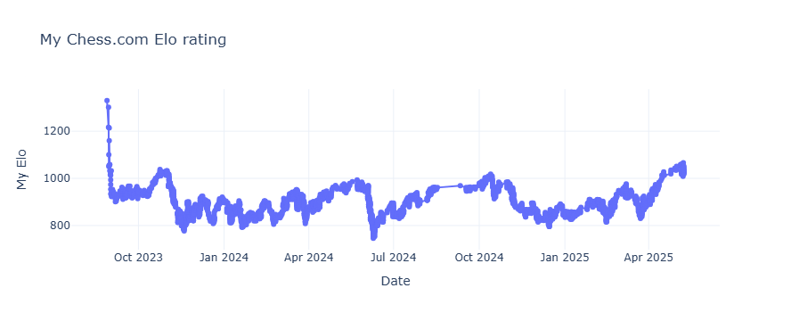


```python
# Aggregate 'My_Elo' values by date
df_daily = df.groupby('Date')['My_Elo'].count().reset_index()

# Create the figure
fig = go.Figure()

# Add trace
fig.add_trace(go.Scatter(
    x=df_daily['Date'],
    y=df_daily['My_Elo'],
    mode='lines+markers',
    name='My Elo'
))

# Update layout to match the style of the Matplotlib plot
fig.update_layout(
    title='Daily # games played on Chess.com',
    xaxis_title='Date',
    yaxis_title='# games played',
    xaxis=dict(showgrid=True),
    yaxis=dict(showgrid=True),
    template='plotly_white'
)

# Show plot
fig.show()
```

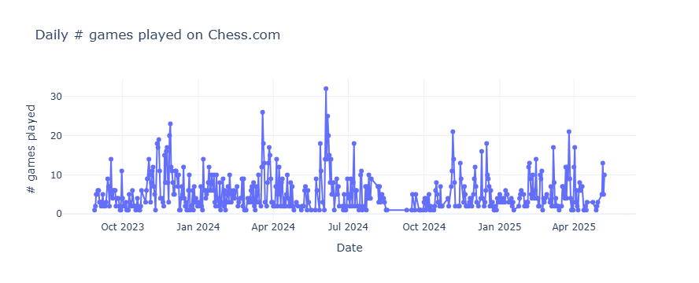

### Black and White


```python
white = df[df['White'] == 'SJB_137']
```


```python
white.Result.value_counts()
```


    Win     649
    Loss    548
    Draw     93
    Name: Result, dtype: int64


```python
# Calculate total games
total_games_white = white.shape[0]

# Count occurrences of each result
total_wins_white = (white['Result'] == 'Win').sum()
total_losses_white = (white['Result'] == 'Loss').sum()
total_draws_white = (white['Result'] == 'Draw').sum()
```


```python
black = df[df['Black'] == 'SJB_137']
```


```python
black.Result.value_counts()
```


    Loss    645
    Win     558
    Draw     84
    Name: Result, dtype: int64


```python
# Calculate total games
total_games_black = black.shape[0]

# Count occurrences of each result
total_wins_black = (black['Result'] == 'Win').sum()
total_losses_black = (black['Result'] == 'Loss').sum()
total_draws_black = (black['Result'] == 'Draw').sum()
```


```python
# Create a pie chart using Plotly
labels_white = ['Wins', 'Losses', 'Draws']
values_white = [total_wins_white, total_losses_white, total_draws_white]

# Create a pie chart using Plotly
labels_black = ['Wins', 'Losses', 'Draws']
values_black = [total_wins_black, total_losses_black, total_draws_black]

# Create figure with subplots
fig = make_subplots(rows=1, cols=2, specs=[[{'type':'domain'}, {'type':'domain'}]],
                    subplot_titles=['White stats', 'Black stats'])

# Pie chart 1
fig.add_trace(go.Pie(labels=labels_white, values=values_white, name='White'), 1, 1)

# Pie chart 2
fig.add_trace(go.Pie(labels=labels_black, values=values_black, name='Black'), 1, 2)

# Update layout
fig.update_layout(
    title_text='Comparison of results playing as Black or White',
    annotations=[dict(text='', x=0.5, y=0.5, font_size=20, showarrow=False) for _ in range(2)],  # Empty annotations for centering
)

# Show plot
fig.show()
```

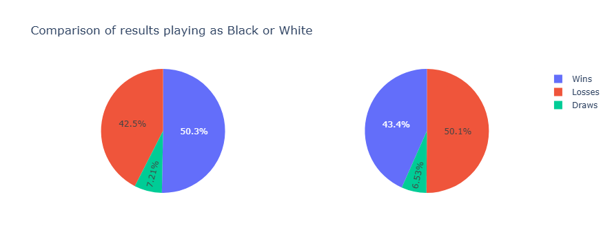


As expected playing as White gives me an advantage which is translated into a higher win rate.

### Opening Variations

https://www.365chess.com/eco.php


```python
df.VariationName.value_counts()
```


    Scandinavian Defense Mieses Kotrc Variation    104
    Scandinavian Defense                           102
    Queens Pawn Opening                             97
    Bishops Opening                                 87
    Queens Pawn Opening Chigorin Variation          65
                                                  ... 
    Kings Gambit Declined Keene Defense              1
    Ruy Lopez Opening Classical Defense              1
    Reti Opening Ross Gambit                         1
    Portuguese Opening                               1
    Birds Opening Dutch Variation                    1
    Name: VariationName, Length: 126, dtype: int64


```python
# Count the occurrences of each variation name
opening_counts = df['VariationName'].value_counts().head(10).reset_index()
opening_counts.columns = ['VariationName', 'Count']

# Sort the DataFrame in decreasing order of 'Count'
opening_counts = opening_counts.sort_values(by='Count', ascending=True)

# Create a bar plot using Plotly
fig = px.bar(opening_counts, x='Count', y='VariationName', orientation='h', 
             title='Top 10 variations based on my Chess.com games', 
             labels={'VariationName': 'Variation name', 'Count': 'Count'})

fig.show()
```

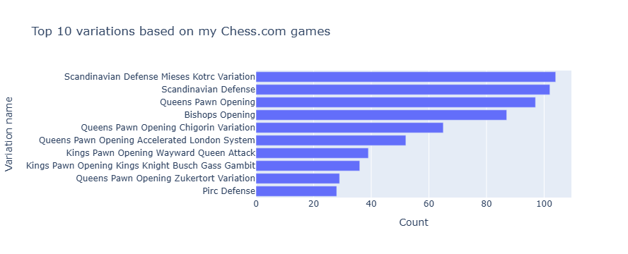

### Convert chess notation to board co-ordinates


```python
# Function to convert chess notation to board coordinates (0-63)
def chess_notation_to_index(move):
    file_map = {'a': 0, 'b': 1, 'c': 2, 'd': 3, 'e': 4, 'f': 5, 'g': 6, 'h': 7}
    rank_map = {'1': 7, '2': 6, '3': 5, '4': 4, '5': 3, '6': 2, '7': 1, '8': 0}
    
    if move[0] == 'N':
        file_char = move[1]
    else:
        file_char = move[0]
        
    if move[0] == 'N':
        rank_char = move[2]
    else:
        rank_char = move[1]
    
    file_index = file_map[file_char]
    rank_index = rank_map[rank_char]
    
    return rank_index * 8 + file_index
```

### Visualisation of first moves as WHITE


```python
# Apply function using .loc to avoid SettingWithCopyWarning
white.loc[:, 'my_move_1_index'] = white['my_move_1'].apply(chess_notation_to_index)
white.my_move_1.value_counts()
```

    c:\Users\User\anaconda3\lib\site-packages\pandas\core\indexing.py:1667: SettingWithCopyWarning:
    
    
    A value is trying to be set on a copy of a slice from a DataFrame.
    Try using .loc[row_indexer,col_indexer] = value instead
    
    See the caveats in the documentation: https://pandas.pydata.org/pandas-docs/stable/user_guide/indexing.html#returning-a-view-versus-a-copy
    


    e4     788
    d4     494
    e3       7
    Nf3      1
    Name: my_move_1, dtype: int64


```python
# Calculate frequencies of each move_1 position on an 8x8 chessboard
white_heatmap_data = [[0]*8 for _ in range(8)]

for position in white['my_move_1_index']:
    row = position // 8
    col = position % 8
    white_heatmap_data[row][col] += 1
```


```python
# Create annotated heatmap using Plotly
fig = go.Figure(data=go.Heatmap(
    z=white_heatmap_data,
    x=['a', 'b', 'c', 'd', 'e', 'f', 'g', 'h'],
    y=['8', '7', '6', '5', '4', '3', '2', '1'],  # Correct order for y-axis
    colorscale='Blues',
    colorbar=dict(title='Frequency')
))

# Add annotations
for i in range(len(white_heatmap_data)):
    for j in range(len(white_heatmap_data[i])):
        fig.add_annotation(
            x=j, y=i,
            text=str(white_heatmap_data[i][j]),
            showarrow=False,
            font=dict(color='black', size=12)
        )

# Update layout to correctly order the y-axis
fig.update_layout(
    title='Distribution of my opening moves playing as WHITE on Chess.com',
    xaxis=dict(title='File'),
    yaxis=dict(title='Rank', autorange='reversed'),
    xaxis_tickmode='array',
    yaxis_tickmode='array',
    xaxis_tickvals=list(range(8)),
    yaxis_tickvals=list(range(8)),
    xaxis_ticktext=['a', 'b', 'c', 'd', 'e', 'f', 'g', 'h'],
    yaxis_ticktext=['8', '1', '2', '3', '4', '5', '6', '7'],  # Correct order for y-axis
    width=600,
    height=500,
    autosize=False
)

# Show plot
fig.show()
```

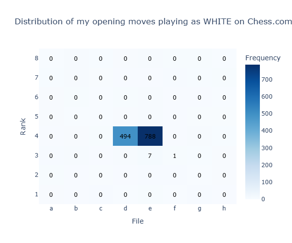

### Visualisation of first moves as BLACK


```python
# Apply function using .loc to avoid SettingWithCopyWarning
black.loc[:, 'my_move_1_index'] = black['my_move_1'].apply(chess_notation_to_index)
black.my_move_1.value_counts()
```


    e5     634
    d5     508
    e6      61
    Nf6     27
    Nc6     26
    d6       8
    f6       5
    b6       3
    Na6      3
    g6       3
    c5       2
    a5       2
    g5       2
    b5       1
    Nh6      1
    h5       1
    Name: my_move_1, dtype: int64


```python
# Calculate frequencies of each move_1 position on an 8x8 chessboard
black_heatmap_data = [[0]*8 for _ in range(8)]

for position in black['my_move_1_index']:
    row = position // 8
    col = position % 8
    black_heatmap_data[row][col] += 1
```


```python
# Create annotated heatmap using Plotly
fig = go.Figure(data=go.Heatmap(
    z=black_heatmap_data,
    x=['a', 'b', 'c', 'd', 'e', 'f', 'g', 'h'],
    y=['8', '7', '6', '5', '4', '3', '2', '1'],  # Correct order for y-axis
    colorscale='Blues',
    colorbar=dict(title='Frequency')
))

# Add annotations
for i in range(len(black_heatmap_data)):
    for j in range(len(black_heatmap_data[i])):
        fig.add_annotation(
            x=j, y=i,
            text=str(black_heatmap_data[i][j]),
            showarrow=False,
            font=dict(color='black', size=12)
        )

# Update layout to correctly order the y-axis
fig.update_layout(
    title='Distribution of my opening moves playing as BLACK on Chess.com',
    xaxis=dict(title='File'),
    yaxis=dict(title='Rank', autorange='reversed'),
    xaxis_tickmode='array',
    yaxis_tickmode='array',
    xaxis_tickvals=list(range(8)),
    yaxis_tickvals=list(range(8)),
    xaxis_ticktext=['a', 'b', 'c', 'd', 'e', 'f', 'g', 'h'],
    yaxis_ticktext=['8', '1', '2', '3', '4', '5', '6', '7'],  # Correct order for y-axis
    width=600,
    height=500,
    autosize=False
)

# Show plot
fig.show()
```

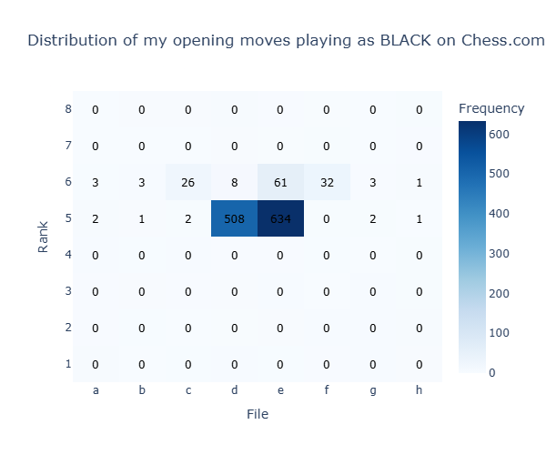


### Opening move win rates as WHITE


```python
# Aggregate the results by first move
move_results_white = white.groupby(['my_move_1','Result']).size().unstack(fill_value=0)

# Calculate win rates
move_results_white['Total'] = move_results_white.sum(axis=1)
move_results_white['Win Rate'] = (move_results_white['Win'] / move_results_white['Total']) * 100
move_results_white
```


<div>
<style scoped>
    .dataframe tbody tr th:only-of-type {
        vertical-align: middle;
    }

    .dataframe tbody tr th {
        vertical-align: top;
    }

    .dataframe thead th {
        text-align: right;
    }
</style>
<table border="1" class="dataframe">
  <thead>
    <tr style="text-align: right;">
      <th>Result</th>
      <th>Draw</th>
      <th>Loss</th>
      <th>Win</th>
      <th>Total</th>
      <th>Win Rate</th>
    </tr>
    <tr>
      <th>my_move_1</th>
      <th></th>
      <th></th>
      <th></th>
      <th></th>
      <th></th>
    </tr>
  </thead>
  <tbody>
    <tr>
      <th>Nf3</th>
      <td>0</td>
      <td>1</td>
      <td>0</td>
      <td>1</td>
      <td>0.000000</td>
    </tr>
    <tr>
      <th>d4</th>
      <td>32</td>
      <td>207</td>
      <td>255</td>
      <td>494</td>
      <td>51.619433</td>
    </tr>
    <tr>
      <th>e3</th>
      <td>0</td>
      <td>5</td>
      <td>2</td>
      <td>7</td>
      <td>28.571429</td>
    </tr>
    <tr>
      <th>e4</th>
      <td>61</td>
      <td>335</td>
      <td>392</td>
      <td>788</td>
      <td>49.746193</td>
    </tr>
  </tbody>
</table>
</div>


### Heatmap of opening move win rates as WHITE


```python
# Initialize an 8x8 matrix with zeros
white_heatmap_data_winrates = [[0 for _ in range(8)] for _ in range(8)]
```


```python
# Aggregate the results by first move
move_results_white_index = white.groupby(['my_move_1_index','Result']).size().unstack(fill_value=0)

# Calculate win rates
move_results_white_index['Total'] = move_results_white_index.sum(axis=1)
move_results_white_index['Win Rate'] = (move_results_white_index['Win'] / move_results_white_index['Total']) * 100

# Fill the heatmap data with win rates
for move, row in move_results_white_index.iterrows():
    row_idx = move // 8
    col_idx = move % 8
    white_heatmap_data_winrates[row_idx][col_idx] = row['Win Rate']

# Create the heatmap with percentage win rates
fig = go.Figure(data=go.Heatmap(
    z=white_heatmap_data_winrates,
    x=['a', 'b', 'c', 'd', 'e', 'f', 'g', 'h'],
    y=['8', '7', '6', '5', '4', '3', '2', '1'],  # Correct order for y-axis
    colorscale='Blues',
    colorbar=dict(title='Win Rate (%)')
))

# Add annotations for the percentage win rates
for i in range(len(white_heatmap_data_winrates)):
    for j in range(len(white_heatmap_data_winrates[i])):
        fig.add_annotation(
            x=j, y=i,
            text=f"{white_heatmap_data_winrates[i][j]:.1f}%",
            showarrow=False,
            font=dict(color='black', size=12)
        )

# Update layout to correctly order the y-axis
fig.update_layout(
    title='Win rates based on my opening move playing as WHITE',
    xaxis=dict(title='File'),
    yaxis=dict(title='Rank', autorange='reversed'),
    xaxis_tickmode='array',
    yaxis_tickmode='array',
    xaxis_tickvals=list(range(8)),
    yaxis_tickvals=list(range(8)),
    xaxis_ticktext=['a', 'b', 'c', 'd', 'e', 'f', 'g', 'h'],
    yaxis_ticktext=['8', '1', '2', '3', '4', '5', '6', '7'],  # Correct order for y-axis
    width=600,
    height=500,
    autosize=False
)

# Show plot
fig.show()
```

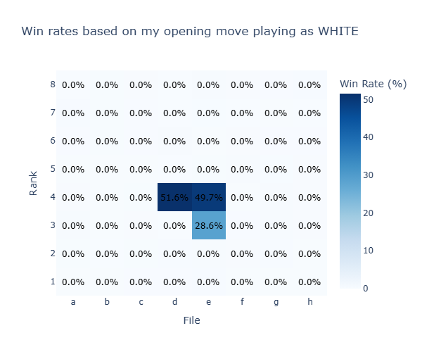

### Opening move win rates as BLACK


```python
# Aggregate the results by first move
move_results_black = black.groupby(['my_move_1','Result']).size().unstack(fill_value=0)
# Calculate win rates
move_results_black['Total'] = move_results_black.sum(axis=1)
move_results_black['Win Rate'] = (move_results_black['Win'] / move_results_black['Total']) * 100
move_results_black
```


<div>
<style scoped>
    .dataframe tbody tr th:only-of-type {
        vertical-align: middle;
    }

    .dataframe tbody tr th {
        vertical-align: top;
    }

    .dataframe thead th {
        text-align: right;
    }
</style>
<table border="1" class="dataframe">
  <thead>
    <tr style="text-align: right;">
      <th>Result</th>
      <th>Draw</th>
      <th>Loss</th>
      <th>Win</th>
      <th>Total</th>
      <th>Win Rate</th>
    </tr>
    <tr>
      <th>my_move_1</th>
      <th></th>
      <th></th>
      <th></th>
      <th></th>
      <th></th>
    </tr>
  </thead>
  <tbody>
    <tr>
      <th>Na6</th>
      <td>1</td>
      <td>2</td>
      <td>0</td>
      <td>3</td>
      <td>0.000000</td>
    </tr>
    <tr>
      <th>Nc6</th>
      <td>1</td>
      <td>18</td>
      <td>7</td>
      <td>26</td>
      <td>26.923077</td>
    </tr>
    <tr>
      <th>Nf6</th>
      <td>2</td>
      <td>18</td>
      <td>7</td>
      <td>27</td>
      <td>25.925926</td>
    </tr>
    <tr>
      <th>Nh6</th>
      <td>0</td>
      <td>0</td>
      <td>1</td>
      <td>1</td>
      <td>100.000000</td>
    </tr>
    <tr>
      <th>a5</th>
      <td>0</td>
      <td>2</td>
      <td>0</td>
      <td>2</td>
      <td>0.000000</td>
    </tr>
    <tr>
      <th>b5</th>
      <td>0</td>
      <td>1</td>
      <td>0</td>
      <td>1</td>
      <td>0.000000</td>
    </tr>
    <tr>
      <th>b6</th>
      <td>0</td>
      <td>2</td>
      <td>1</td>
      <td>3</td>
      <td>33.333333</td>
    </tr>
    <tr>
      <th>c5</th>
      <td>0</td>
      <td>2</td>
      <td>0</td>
      <td>2</td>
      <td>0.000000</td>
    </tr>
    <tr>
      <th>d5</th>
      <td>33</td>
      <td>253</td>
      <td>222</td>
      <td>508</td>
      <td>43.700787</td>
    </tr>
    <tr>
      <th>d6</th>
      <td>0</td>
      <td>2</td>
      <td>6</td>
      <td>8</td>
      <td>75.000000</td>
    </tr>
    <tr>
      <th>e5</th>
      <td>45</td>
      <td>305</td>
      <td>284</td>
      <td>634</td>
      <td>44.794953</td>
    </tr>
    <tr>
      <th>e6</th>
      <td>2</td>
      <td>33</td>
      <td>26</td>
      <td>61</td>
      <td>42.622951</td>
    </tr>
    <tr>
      <th>f6</th>
      <td>0</td>
      <td>3</td>
      <td>2</td>
      <td>5</td>
      <td>40.000000</td>
    </tr>
    <tr>
      <th>g5</th>
      <td>0</td>
      <td>0</td>
      <td>2</td>
      <td>2</td>
      <td>100.000000</td>
    </tr>
    <tr>
      <th>g6</th>
      <td>0</td>
      <td>3</td>
      <td>0</td>
      <td>3</td>
      <td>0.000000</td>
    </tr>
    <tr>
      <th>h5</th>
      <td>0</td>
      <td>1</td>
      <td>0</td>
      <td>1</td>
      <td>0.000000</td>
    </tr>
  </tbody>
</table>
</div>


### Heatmap of opening move win rates as BLACK


```python
# Initialize an 8x8 matrix with zeros
black_heatmap_data_winrates = [[0 for _ in range(8)] for _ in range(8)]
```


```python
# Aggregate the results by first move
move_results_black_index = black.groupby(['my_move_1_index','Result']).size().unstack(fill_value=0)

# Calculate win rates
move_results_black_index['Total'] = move_results_black_index.sum(axis=1)
move_results_black_index['Win Rate'] = (move_results_black_index['Win'] / move_results_black_index['Total']) * 100


# Fill the heatmap data with win rates
for move, row in move_results_black_index.iterrows():
    row_idx = move // 8
    col_idx = move % 8
    black_heatmap_data_winrates[row_idx][col_idx] = row['Win Rate']

# Create the heatmap with percentage win rates
fig = go.Figure(data=go.Heatmap(
    z=black_heatmap_data_winrates,
    x=['a', 'b', 'c', 'd', 'e', 'f', 'g', 'h'],
    y=['8', '7', '6', '5', '4', '3', '2', '1'],  # Correct order for y-axis
    colorscale='Blues',
    colorbar=dict(title='Win Rate (%)')
))

# Add annotations for the percentage win rates
for i in range(len(black_heatmap_data_winrates)):
    for j in range(len(black_heatmap_data_winrates[i])):
        fig.add_annotation(
            x=j, y=i,
            text=f"{black_heatmap_data_winrates[i][j]:.1f}%",
            showarrow=False,
            font=dict(color='black', size=12)
        )

# Update layout to correctly order the y-axis
fig.update_layout(
    title='Win rates based on my opening move playing as BLACK',
    xaxis=dict(title='File'),
    yaxis=dict(title='Rank', autorange='reversed'),
    xaxis_tickmode='array',
    yaxis_tickmode='array',
    xaxis_tickvals=list(range(8)),
    yaxis_tickvals=list(range(8)),
    xaxis_ticktext=['a', 'b', 'c', 'd', 'e', 'f', 'g', 'h'],
    yaxis_ticktext=['8', '1', '2', '3', '4', '5', '6', '7'],  # Correct order for y-axis
    width=600,
    height=500,
    autosize=False
)

# Show plot
fig.show()
```

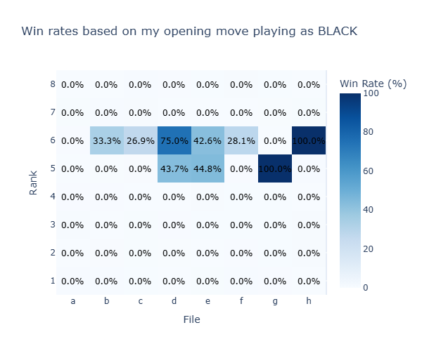

### Win rates by Day of the Week


```python
# Aggregate the results by day of the week
day_of_the_week_results = df.groupby(['day_of_the_week','Result']).size().unstack(fill_value=0)
# Calculate win rates
day_of_the_week_results['Total'] = day_of_the_week_results.sum(axis=1)
day_of_the_week_results['Win Rate'] = (day_of_the_week_results['Win'] / day_of_the_week_results['Total']) * 100
day_of_the_week_results
```


<div>
<style scoped>
    .dataframe tbody tr th:only-of-type {
        vertical-align: middle;
    }

    .dataframe tbody tr th {
        vertical-align: top;
    }

    .dataframe thead th {
        text-align: right;
    }
</style>
<table border="1" class="dataframe">
  <thead>
    <tr style="text-align: right;">
      <th>Result</th>
      <th>Draw</th>
      <th>Loss</th>
      <th>Win</th>
      <th>Total</th>
      <th>Win Rate</th>
    </tr>
    <tr>
      <th>day_of_the_week</th>
      <th></th>
      <th></th>
      <th></th>
      <th></th>
      <th></th>
    </tr>
  </thead>
  <tbody>
    <tr>
      <th>Friday</th>
      <td>25</td>
      <td>154</td>
      <td>162</td>
      <td>341</td>
      <td>47.507331</td>
    </tr>
    <tr>
      <th>Monday</th>
      <td>33</td>
      <td>174</td>
      <td>215</td>
      <td>422</td>
      <td>50.947867</td>
    </tr>
    <tr>
      <th>Saturday</th>
      <td>14</td>
      <td>94</td>
      <td>91</td>
      <td>199</td>
      <td>45.728643</td>
    </tr>
    <tr>
      <th>Sunday</th>
      <td>16</td>
      <td>135</td>
      <td>109</td>
      <td>260</td>
      <td>41.923077</td>
    </tr>
    <tr>
      <th>Thursday</th>
      <td>25</td>
      <td>224</td>
      <td>183</td>
      <td>432</td>
      <td>42.361111</td>
    </tr>
    <tr>
      <th>Tuesday</th>
      <td>34</td>
      <td>215</td>
      <td>226</td>
      <td>475</td>
      <td>47.578947</td>
    </tr>
    <tr>
      <th>Wednesday</th>
      <td>30</td>
      <td>197</td>
      <td>221</td>
      <td>448</td>
      <td>49.330357</td>
    </tr>
  </tbody>
</table>
</div>


```python
# Reset index to use day_of_the_week as a column for plotting
day_of_the_week_results = day_of_the_week_results.reset_index()

# Define the order of days
days_order = ['Monday', 'Tuesday', 'Wednesday', 'Thursday', 'Friday', 'Saturday', 'Sunday']

# Create a horizontal bar plot using Plotly
fig = px.bar(day_of_the_week_results, x='Win Rate', y='day_of_the_week', orientation='h', 
             title='Win rate by day of the week', 
             labels={'day_of_the_week': 'Day', 'Win Rate': 'Win rate (%)'},
             category_orders={'day_of_the_week': days_order})

fig.show()
```
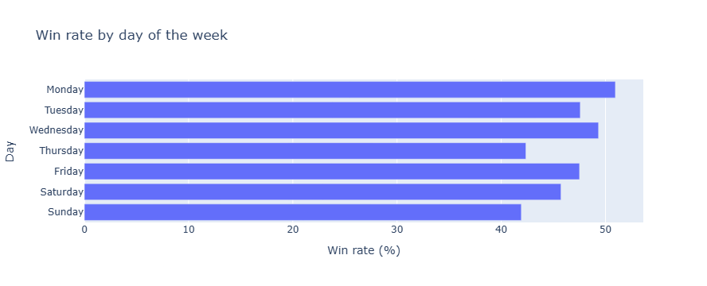


So, it looks like Mondays and Wednesdays are the best days for me to play. What time of day though?

### Morning, afternoon, evening


```python
# Aggregate the results by time of day
time_of_day_results = df.groupby(['time_of_day','Result']).size().unstack(fill_value=0)
# Calculate win rates
time_of_day_results['Total'] = time_of_day_results.sum(axis=1)
time_of_day_results['Win Rate'] = (time_of_day_results['Win'] / time_of_day_results['Total']) * 100
time_of_day_results
```


<div>
<style scoped>
    .dataframe tbody tr th:only-of-type {
        vertical-align: middle;
    }

    .dataframe tbody tr th {
        vertical-align: top;
    }

    .dataframe thead th {
        text-align: right;
    }
</style>
<table border="1" class="dataframe">
  <thead>
    <tr style="text-align: right;">
      <th>Result</th>
      <th>Draw</th>
      <th>Loss</th>
      <th>Win</th>
      <th>Total</th>
      <th>Win Rate</th>
    </tr>
    <tr>
      <th>time_of_day</th>
      <th></th>
      <th></th>
      <th></th>
      <th></th>
      <th></th>
    </tr>
  </thead>
  <tbody>
    <tr>
      <th>afternoon</th>
      <td>10</td>
      <td>58</td>
      <td>75</td>
      <td>143</td>
      <td>52.447552</td>
    </tr>
    <tr>
      <th>evening</th>
      <td>78</td>
      <td>477</td>
      <td>476</td>
      <td>1031</td>
      <td>46.168768</td>
    </tr>
    <tr>
      <th>graveyard</th>
      <td>60</td>
      <td>492</td>
      <td>490</td>
      <td>1042</td>
      <td>47.024952</td>
    </tr>
    <tr>
      <th>morning</th>
      <td>29</td>
      <td>166</td>
      <td>166</td>
      <td>361</td>
      <td>45.983380</td>
    </tr>
  </tbody>
</table>
</div>


```python
# Reset index to use day_of_the_week as a column for plotting
time_of_day_results = time_of_day_results.reset_index()

# Define the order
time_of_day_order = ['morning', 'afternoon', 'evening', 'graveyard']

# Create a horizontal bar plot using Plotly
fig = px.bar(time_of_day_results, x='Win Rate', y='time_of_day', orientation='h', 
             title='Win rate by time of day', 
             labels={'time_of_day': 'Time of day', 'Win Rate': 'Win rate (%)'},
             category_orders={'time_of_day': time_of_day_order})

fig.show()
```

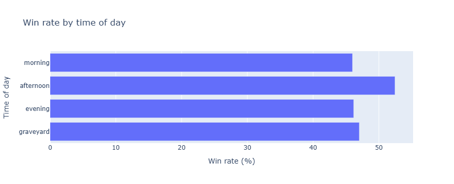

It seems like afternoons are best. So, Monday and Wednesday afternoons, might be a sensible time to play.

### Number of moves


```python
# Aggregate the results by number of moves
number_moves_results = df.groupby(['number_moves','Result']).size().unstack(fill_value=0)
# Calculate win rates
number_moves_results['Total'] = number_moves_results.sum(axis=1)
number_moves_results['Win Rate'] = (number_moves_results['Win'] / number_moves_results['Total']) * 100
number_moves_results['Loss Rate'] = (number_moves_results['Loss'] / number_moves_results['Total']) * 100
number_moves_results['Draw Rate'] = (number_moves_results['Draw'] / number_moves_results['Total']) * 100
number_moves_results
```


<div>
<style scoped>
    .dataframe tbody tr th:only-of-type {
        vertical-align: middle;
    }

    .dataframe tbody tr th {
        vertical-align: top;
    }

    .dataframe thead th {
        text-align: right;
    }
</style>
<table border="1" class="dataframe">
  <thead>
    <tr style="text-align: right;">
      <th>Result</th>
      <th>Draw</th>
      <th>Loss</th>
      <th>Win</th>
      <th>Total</th>
      <th>Win Rate</th>
      <th>Loss Rate</th>
      <th>Draw Rate</th>
    </tr>
    <tr>
      <th>number_moves</th>
      <th></th>
      <th></th>
      <th></th>
      <th></th>
      <th></th>
      <th></th>
      <th></th>
    </tr>
  </thead>
  <tbody>
    <tr>
      <th>1</th>
      <td>0</td>
      <td>0</td>
      <td>2</td>
      <td>2</td>
      <td>100.0</td>
      <td>0.0</td>
      <td>0.0</td>
    </tr>
    <tr>
      <th>2</th>
      <td>0</td>
      <td>0</td>
      <td>1</td>
      <td>1</td>
      <td>100.0</td>
      <td>0.0</td>
      <td>0.0</td>
    </tr>
    <tr>
      <th>3</th>
      <td>0</td>
      <td>0</td>
      <td>3</td>
      <td>3</td>
      <td>100.0</td>
      <td>0.0</td>
      <td>0.0</td>
    </tr>
    <tr>
      <th>4</th>
      <td>0</td>
      <td>0</td>
      <td>25</td>
      <td>25</td>
      <td>100.0</td>
      <td>0.0</td>
      <td>0.0</td>
    </tr>
    <tr>
      <th>5</th>
      <td>0</td>
      <td>3</td>
      <td>9</td>
      <td>12</td>
      <td>75.0</td>
      <td>25.0</td>
      <td>0.0</td>
    </tr>
    <tr>
      <th>...</th>
      <td>...</td>
      <td>...</td>
      <td>...</td>
      <td>...</td>
      <td>...</td>
      <td>...</td>
      <td>...</td>
    </tr>
    <tr>
      <th>100</th>
      <td>1</td>
      <td>0</td>
      <td>0</td>
      <td>1</td>
      <td>0.0</td>
      <td>0.0</td>
      <td>100.0</td>
    </tr>
    <tr>
      <th>104</th>
      <td>0</td>
      <td>0</td>
      <td>1</td>
      <td>1</td>
      <td>100.0</td>
      <td>0.0</td>
      <td>0.0</td>
    </tr>
    <tr>
      <th>115</th>
      <td>1</td>
      <td>0</td>
      <td>0</td>
      <td>1</td>
      <td>0.0</td>
      <td>0.0</td>
      <td>100.0</td>
    </tr>
    <tr>
      <th>116</th>
      <td>1</td>
      <td>0</td>
      <td>0</td>
      <td>1</td>
      <td>0.0</td>
      <td>0.0</td>
      <td>100.0</td>
    </tr>
    <tr>
      <th>137</th>
      <td>1</td>
      <td>0</td>
      <td>0</td>
      <td>1</td>
      <td>0.0</td>
      <td>0.0</td>
      <td>100.0</td>
    </tr>
  </tbody>
</table>
<p>98 rows × 7 columns</p>
</div>


```python
# Reset index to use number_moves as a column for plotting
number_moves_results = number_moves_results.reset_index()

# Create a line plot for Win Rate vs number of moves using Plotly
fig = px.line(number_moves_results, x='number_moves', y='Win Rate', 
              title='My win rate vs number of moves on Chess.com', 
              labels={'number_moves': 'Number of moves', 'Win Rate': 'Win rate (%)'})

fig.show()
```

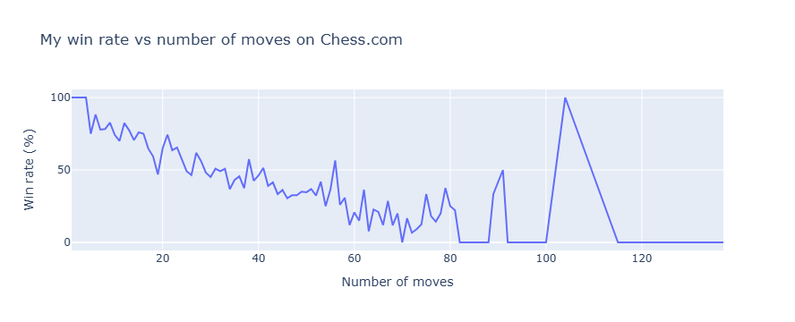

From the above graphic I can see that my win rates generally tend to fall as the length of the game increases. That doesn't necessarily mean I tend to lose as the game length increases - the longer the game, the more likely the result will be a draw, I suspect. Let's plot draw rate against number of moves to see if this is the case.


```python
# Create a line plot for Draw Rate vs number of moves using Plotly
fig = px.line(number_moves_results, x='number_moves', y='Draw Rate', 
              title='My draw rate vs number of moves on Chess.com', 
              labels={'number_moves': 'Number of moves', 'Win Rate': 'Win rate (%)'})

fig.show()
```

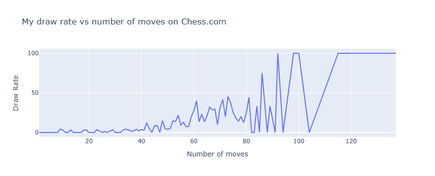
